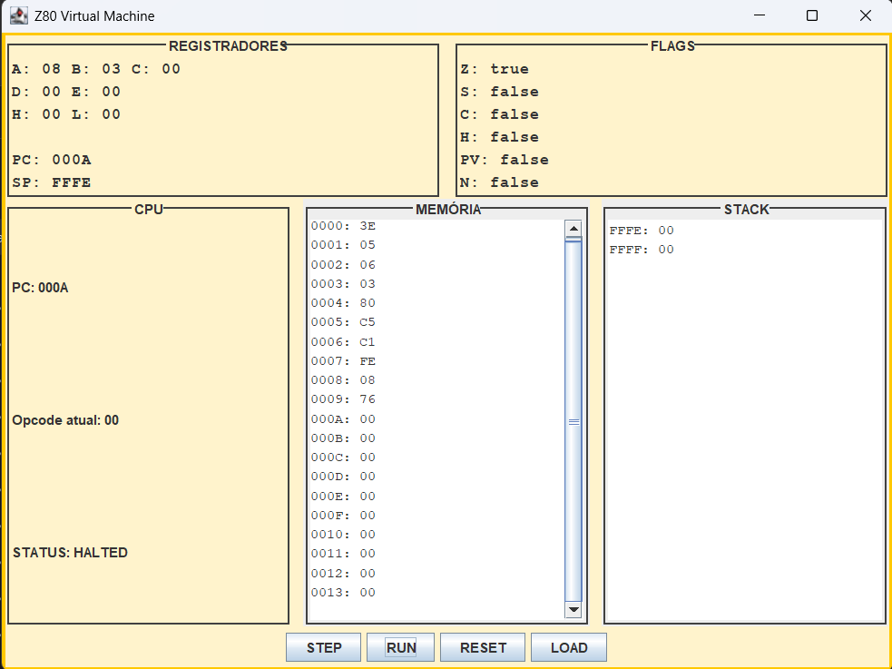

# 💻 Maquina Virtual Z80

Simulador de uma CPU baseada no Z80, desenvolvido em Java, com suporte a execução de instruções, manipulação de memória, stack, e interface gráfica interativa.

---

## 🚀 Tecnologias utilizadas

* Java JDK 17
* IDE: NetBeans
* Interface gráfica: Java Swing

---

## ▶️ Como executar o projeto

### 🔧 Pré-requisitos

* Java JDK 17 instalado
* NetBeans (recomendado)

### ▶️ Executando

1. Abra o projeto no NetBeans
2. Compile o projeto
3. Execute a classe `Main.java`

A interface gráfica será aberta automaticamente.

---

## 🖥️ Interface gráfica

A GUI permite visualizar e controlar a execução da CPU em tempo real.

### Funcionalidades:

* Visualização dos registradores (A, B, C, D, E, H, L, PC, SP)
* Visualização das flags (Zero, Sign, Carry, etc.)
* Exibição da memória
* Exibição da stack
* Instrução atual sendo executada
* Estado da CPU (RUNNING / HALTED)

### Botões:

* **STEP** → executa uma instrução por vez
* **RUN** → executa continuamente
* **RESET** → reinicia a CPU
* **LOAD** → carrega um programa a partir de arquivo `.txt`

---

## 📂 Estrutura do projeto

* `CPU.java` → ciclo de execução (fetch, decode, execute)
* `Memory.java` → gerenciamento da memória
* `Registers.java` → registradores da CPU
* `Flags.java` → controle das flags
* `Stack.java` → operações de pilha (push/pop)
* `ProgramLoader.java` → leitura de programas a partir de arquivo
* `GUI.java` → interface gráfica
* `Main.java` → ponto de entrada da aplicação

---

## 🧠 Instruções implementadas

### 📌 Aritméticas e lógicas

* ADD (A, n e A, B)
* SUB
* AND
* OR
* XOR
* CP

### 📌 Controle de fluxo

* JP
* JR
* CALL
* RET

### 📌 Manipulação de registradores

* LD A, n
* LD B, n
* INC
* DEC

### 📌 Stack

* PUSH
* POP

### 📌 Outras

* HALT

---

## 📄 Formato do programa

Os programas são carregados a partir de arquivos `.txt` contendo opcodes em hexadecimal, um por linha.

### Exemplo:

3E
05
06
03
80
C5
C1
FE
08
76

---

## 🧪 Exemplo de execução

Programa:

* LD A, 5
* LD B, 3
* ADD A, B
* PUSH BC
* POP BC
* CP 8
* HALT

Resultado esperado:

* A = 8
* Zero flag = true
* CPU em estado HALTED

---

## 📸 Prints da interface

---

## 🎯 Objetivo do projeto

Simular o funcionamento básico de uma CPU baseada no Z80, permitindo a execução de instruções, manipulação de memória e análise do comportamento interno da máquina.

---

## 👩‍💻 Autores

Milena Alves Ferreira

---
